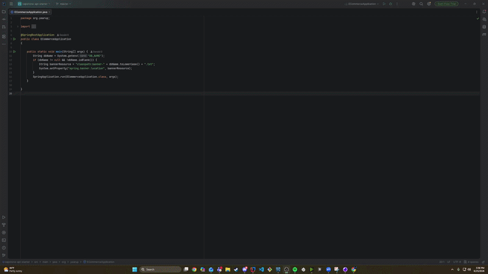

# Video Game Store

## Description of the Project

Capstone E-Commerce REST API
A RESTful API built with Spring Boot 4, Java 17, MySQL, and JWT authentication. This backend is designed to power any e-commerce frontend — including implementations for a videogame store, clothing store, record shop, and grocery store — as long as the frontend is configured to communicate with the API endpoints.
The API follows a layered architecture pattern with controllers, services, and repositories, using Spring Data JPA for database interaction and Spring Security for role-based access control.

### Features:

- JWT authentication and registration with ROLE_USER and ROLE_ADMIN access levels
- Full CRUD operations for product categories with admin-only write access
- Product search and filtering by category, price range, and subcategory — including a bug fix for a filter that was incorrectly excluding non-featured products from results
- Shopping cart management including adding products, updating quantities, and clearing the cart
- User profile retrieval and updates
- Checkout functionality that converts a shopping cart into an order, saves line items, and clears the cart on completion

## User Stories

- As a user, I can view all categories so that I can browse what's available in the store.
- As a user, I can view a category by ID so that I can see details for a specific category.
- As an admin, I can create a category so that I can add new sections to the store.
- As an admin, I can update a category so that I can fix or change category details.
- As an admin, I can delete a category so that I can remove categories no longer needed.
- As a user, I can view products in a category so that I can browse items within a specific section.
- As a user, I can view my shopping cart so that I can see what I've added before checking out.
- As a user, I can add a product to my cart so that I can save items I want to buy.
- As a user, I can update a cart item quantity so that I can change how many of an item I want.
- As a user, I can clear my cart so that I can start fresh if I change my mind.
- As a user, I can view my profile so that I can see my saved information.
- As a user, I can update my profile so that I can keep my information current.
- As a user, I can check out and create an order so that I can complete my purchase.
- As a user, search and filter returns all matching products so that I can find exactly what I'm looking for.

## Setup

Instructions on how to set up and run the project using IntelliJ IDEA.

### Prerequisites

- IntelliJ IDEA: Ensure you have IntelliJ IDEA installed, which you can download from [here](https://www.jetbrains.com/idea/download/).
- Java SDK: Make sure Java SDK is installed and configured in IntelliJ.
- MySQL: Ensure MySQL is installed and running. Create the database by running the provided SQL script in the database folder.
- Maven: The project uses Maven for dependency management. IntelliJ will handle this automatically when you open the project — just wait for it to download all dependencies from the pom.xml.

### Running the Application in IntelliJ

Follow these steps to get your application running within IntelliJ IDEA:

1. Open IntelliJ IDEA.
2. Select "Open" and navigate to the directory where you cloned or downloaded the project.
3. After the project opens, wait for IntelliJ to index the files and set up the project.
4. Find the main class with the `public static void main(String[] args)` method.
5. Before running, open application.properties and make sure your MySQL username and password match your local setup under DB_USERNAME and DB_PASSWORD.
6. The database name defaults to videogamestore but can be changed via the DB_NAME environment variable in your run configuration.
7. Right-click on the file and select 'Run 'YourMainClassName.main()'' to start the application.

## Technologies Used

- Java: corretto-17 Amazon Corretto 17.0.18

## Demo

## Future Work

- Add order history so users can view past purchases
- Implement product reviews and ratings
- Add an admin dashboard for managing products and viewing sales data

## Resources

- [GitHub Resource](https://github.com/RayMaroun/yearup-spring-section-8-2026)
- [Java Visual](https://raymaroun.github.io/yearup-java-visuals/)
- [CSS](https://developer.mozilla.org/en-US/docs/Web/CSS/Guides/Transitions/Using)
- [JavaScript](https://developer.mozilla.org/en-US/docs/Web/JavaScript/Reference/Global_Objects/Array/reduce)

## Team Members

- **Gerald** - Owner

## Thanks

Express gratitude towards those who provided help, guidance, or resources:

- Thank you to Raymond for always being there to answer every question, no matter how big or small. 
Your patience and dedication to making sure we truly understood the material, not just memorized it,
made all the difference. You showed us that with focus and the right mindset we are capable of so much 
more than we thought. It has been an honor learning from you and having you as our sensei throughout this bootcamp.
This may be the last project I present to you in this chapter, but the foundation you helped me build will carry 
forward into everything I do next. Thank you for believing in us.